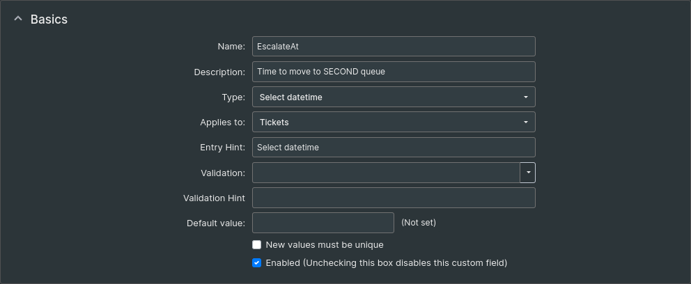
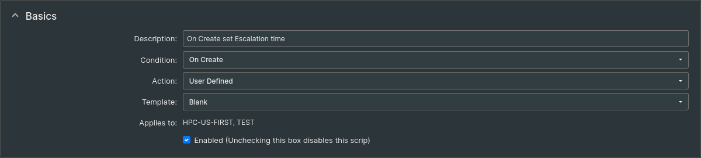

# TTS

La **documentazione** è presente al percorso:  
/mnt/workdir/documentation/TTS.wiki

## RT5 - Ricezione e Invio email

### README.md
Il README.md di questa parte è presente al percorso:  
/root/ms365-application-permissions/README.md

[Qui](#readme-sul-server) c'è la mia versione ripulita.

### Impostazioni

**RT_SiteConfig.pm**

nel file /mnt/workdir/request-tracker/rt5/etc/RT_SiteConfig.pm viene impostata la variabie **SendMailPath**:
```
Set(\$SendmailPath, \'/usr/local/bin/sendmail-msmtp\');
```
dove  
**/usr/local/bin/sendmail-msmtp**  
è il wrapper di msmtp, con permessi 0755, che al suo interno richiama il programma  
**/usr/bin/msmtp**:
```
#!/bin/sh
exec /usr/bin/msmtp "$@"
```

msmtp usa come file di configuraione **/etc/msmtprc**
<details>
<summary>msmtprc</summary>
<br>

defaults

auth            on
tls             on
tls_starttls    on
timeout         60

tls_trust_file  /etc/ssl/certs/ca-certificates.crt

logfile         /var/log/msmtp.log

account m365

host smtp.office365.com
port 587

from tts-micro-devel@cineca.it
user tts-micro-devel@cineca.it

auth xoauth2

passwordeval "/usr/local/bin/get-ms365-token.py"

account default : m365

</details>


per il quale vanno impostati i permessi 0600 e proprietario root:root, mentre per il file di log indicato al suo interno (**/var/log/msmtp.log**) vanno impostati i permessi 0640 e proprietario root:root

**Password evaluation:**  
dentro msmtprc viene indicato  
**/usr/local/bin/get-ms365-token.py**  
per la verifica della password (o token).  
Questo script ha permessi 0755 usa il file di configurazione **/etc/rt/ms365.json**

### Crontab

In crontab va aggiunta la seguente riga per trasferire le email arrivate
alla casella **tts-micro-devel@cineca.it** a RT: :

    */2 * * * * /usr/local/bin/wsgetmail --config /mnt/workdir/request-tracker/rt5/etc/wsgetmail.json


### File e permessi

| File                          | Permessi | Proprietario |
|-------------------------------|----------|--------------|
| /usr/local/bin/sendmail-msmtp | 0755     |              |
| /etc/msmtprc                  | 0600     | root:root    |
| /var/log/msmtp.log            | 0640     | root:root    |


## Plugins

Plugins installati in produzione (**RT4**):
- RT::Extension::ExcelFeed --> per RT6 va bene l'ultima versione, per RT5 la 0.X più recente
- RT::Extension::JSGantt
- RT::Extension::MergeUsers
- RT::Extension::ActivityReports --> per RT6 va bene l'ultima versione, per RT5 la 1.X più recente
- RT::Extension::TimeWorkedReport --> non sembra esserci una versione per RT5 e RT6; probabilmente sostituibile con ActivityReports
- RT::Extension::MandatoryOnTransition --> per RT6 va bene l'ultima versione, per RT5 la 0.X più recente
- RT::Authen::OAuth2

Si possono controllare quali plugin sono stati installati andando al percorso:  
**/mnt/workdir/request-tracker/rt5/local/plugins/**

Questa è la lista dei plugin installati:
- RT-Authen-OAuth2
- RT-Extension-MandatoryOnTransition
- RT-Extension-MergeUsers

Una volta installati, i plugin vanno attivati inserendo in RT_SiteConfig.pm  
**Plugin('RT::Extension::NOME_PLUGIN');**  

Questi quelli attualmente installati:
- Plugin('RT::Extension::ExcelFeed');
- Plugin('RT::Extension::JSGantt');
- Plugin('RT::Extension::MergeUsers');
- Plugin('RT::Extension::ActivityReports');
- Plugin('RT::Extension::MandatoryOnTransition');

**Plugin aggiuntivi che possono essere interessanti**
- RT::Extension::FormTools --> per RT6 va bene l'ultima versione, per RT5 la 1.X più recente
- RT::Extension::RepliesToResolved --> necessita della password del db 
- RTx::Calendar --> per RT6 va bene l'ultima versione, per RT5 la 1.X più recente; necessita del modulo Perl DateTime::Set.
- RT::Extension::ExtractCustomFieldValues --> necessita della password del db
- RT::Extension::AutomaticAssignment --> per RT6 va bene l'ultima versione, per RT5 la 1.X più recente; necessita della password del db
- RT::Extension::QuickAssign --> disponibile solo per RT4 e RT5; magari la RT6 ha già questa funzionalità
- RT::Extension::QuickUpdate --> disponibile solo per RT4 e RT5; magari la RT6 ha già questa funzionalità
- RT::Extension::PreviewInSearch --> per RT6 va bene l'ultima versione, per RT5 la 0.X più recente

QuickAssign e QuickAssign forse sono ridondanti

FormTools è potenzialmente rivoluzionario, dovremmo cambiare completamente il modo in cui gli utenti aprono i ticket, ma se dovesse essere fattibile, ci aiuterebbe molto.

### Istruzioni installazione
Per installare un plugin:
- accedere con root (sudo -i)
- spostarsi in /mnt/workdir/request-tracker/rt5
(non fondamentale, ma meglio fissare una cartella)
- assicurarsi di avere /mnt/workdir/request-tracker/rt5 come RTHOME:  
 export RTHOME=/mnt/workdir/request-tracker/rt5
- da [metacpan](https://metacpan.org/) copiare il link del download (assicurarsi che la versione sia compatibile)
- wget `<link>`
- tar xzf `<file.tar.gz>'
- cd cartella
- seguire istruzioni riportate sul sito
- aggiungere il plugin a RT_SiteConfig.pm  
  Plugin('RT::Extension::NOME');
- cancellare la cache  
  rm -rf /mnt/workdir/request-tracker/rt5/var/mason_data/obj/*
- riavviare il webserver  
  systemctl restart apache2
- rimuovere il file tar.gz e la cartella

Se ci sono problemi dopo il riavvio, assicurarsi che:
- il plugin sia stato installato nella **cartella corretta** (/mnt/workdir/request-tracker/rt5/local/plugins/) e non in quella sotto /opt/
- la **variabile Plugin** in RT_SiteConfig.pm sia riportata correttamente
- /mnt/workdir/request-tracker/rt5/var/mason_data/obj/ abbia come **proprietario www-data** e **NON** root.  
  Se così non fosse, lanciare questi comandi:
  - chown -R www-data:www-data /mnt/workdir/request-tracker/rt5/var/mason_data
  - chmod -R u+rwX /mnt/workdir/request-tracker/rt5/var/mason_data

## README sul server
Questa è una versione modificata (sperabilmente corretta) del README.md presente in /root/ms365-application-permissions/README.md

### SCHEMA

la App Registration possiede solamente:
- IMAP.AccessAsApp
- SMTP.SendAsApp

con queste permission si sta usando il modello "Application Permissions (client credentials grant)." 

In questo caso:

- non esiste alcun utente che fa login
- non esiste refresh token
- non esiste offline_access
- il token viene ottenuto usando client_id + client_secret (oppure certificato)
- il token viene richiesto con scope https://outlook.office365.com/.default

Lo schema:

[sito di riferimento](https://github.com/MicrosoftDocs/office-developer-exchange-docs/blob/main/docs/legacy-protocols/how-to-authenticate-an-imap-pop-smtp-application-by-using-oauth.md)

```
RT5
 ↓  SendMailPath
msmtp
 ↓  password-eval  
get-ms365-token (token helper)
 ↓  Oauth2 Client Credentials
POST https://login.microsoftonline.com/<tenant>/oauth2/v2.0/token (Microsoft Entra ID)

grant_type=client_credentials
client_id=...
client_secret=...
scope=https://outlook.office365.com/.default

 ↓
access token
 ↓
SMTP AUTH XOAUTH2
 ↓
smtp.office365.com:587
 ↓
Exchange Online
```

### TOKEN HELPER

#### create: 

/usr/local/bin/get-ms365-token.py 

#### semplificato diventa:

password-eval.py

è questo che deve essere usato!

#### environment variables:

```
export M365_TENANT_ID="xxxxxxxx-xxxx-xxxx-xxxx-xxxxxxxxxxxx"
export M365_CLIENT_ID="xxxxxxxx-xxxx-xxxx-xxxx-xxxxxxxxxxxx"
export M365_CLIENT_SECRET="your-client-secret-value"
export M365_SMTP_USER="rt-noreply@yourdomain.com"
### export M365_REFRESH_TOKEN_FILE="/var/lib/rt-m365/refresh_token.txt"
export M365_TOKEN_CACHE_FILE="/var/lib/rt-m365/token.json"
```


#### final configuration

cretaed /usr/local/bin/get-ms365-token.py  
chmod 0755 /usr/local/bin/get-ms365-token.py  
created /etc/rt/ms365.json


### MSMTP

#### msmtp config

- create /etc/msmtprc:

```
defaults

auth            on
tls             on
tls_starttls    on
timeout         60

tls_trust_file  /etc/ssl/certs/ca-certificates.crt

logfile         /var/log/msmtp.log

account m365

host smtp.office365.com
port 587

from tts-micro-devel@cineca.it
user tts-micro-devel@cineca.it

auth xoauth2

passwordeval "/usr/local/bin/get-ms365-token.py"

account default : m365

```

- set permissions:

```
sudo chown root:root /etc/msmtprc
sudo chmod 0600 /etc/msmtprc
sudo touch /var/log/msmtp.log
sudo chown root:root /var/log/msmtp.log
sudo chmod 0640 /var/log/msmtp.log
```


#### Sendmail wrapper for RT

Create /usr/local/bin/sendmail-msmtp:

```
#!/bin/sh
exec /usr/bin/msmtp "$@"
```

make it executable:  
sudo chmod 0755 /usr/local/bin/sendmail-msmtp

#### RT 5 configuration:

Create /opt/rt5/etc/RT_SiteConfig.d/50-mailer.pm or place the equivalent in RT_SiteConfig.pm:

```
Set($MailCommand,'sendmailpipe');
Set($SendmailPath, '/usr/local/bin/sendmail-msmtp');

# Optional but often useful:
Set($CorrespondAddress, 'rt-noreply@yourdomain.com');
Set($CommentAddress,    'rt-noreply@yourdomain.com');
Set($FriendlyFromLineFormat, '"%s" <%s

OR 

Set($SendmailPath, '/usr/bin/msmtp');
https://github.com/FireFart/rt-docker/blob/main/RT_SiteConfig.pm.example
```


### TESTING

Before testing RT, confirm that msmtp can send mail!

```
printf 'Subject: test from msmtp\n\nhello\n' | /usr/bin/msmtp -a m365 tts-micro-devel@cineca.it
```

https://kifarunix.com/configure-request-tracker-rt-to-send-mails-using-msmtp-via-office-365-relay/#google_vignette


## Software TTS

Al percorso **/mnt/workdir/request-tracker/rt5/sbin** sono presenti i vari software utili per gestire TTS e il suo DB:
<details>
<summary>lista software</summary>
<br>

- rt-attributes-viewer  
- rt-clean-attributes
- rt-clean-sessions
- rt-clean-shorteners
- rt-dump-initialdata
- rt-dump-metadata
- rt-email-dashboards
- rt-email-digest
- rt-email-expiring-auth-tokens
- rt-email-group-admin
- rt-externalize-attachments
- rt-fulltext-indexer
- rt-importer
- rt-ldapimport
- rt-munge-attachments
- rt-passwd
- rt-preferences-viewer
- rt-search-attributes
- rt-serializer
- rt-server
- rt-server.fcgi
- rt-session-viewer
- rt-setup-database
- rt-setup-fulltext-index
- rt-shredder
- rt-test-dependencies
- rt-validate-aliases
- rt-validator
- standalone_httpd
</details>

Molti possono sia essere usati sia via CLI che tramite GUI

Quelli che ho visto sono:
- **rt-shredder**: pulisce i dati dal DB (Admin --> Tools)
- **rt-clean-sessions**: rimuove le vecchie sessioni degli utenti
- **rt-setup-fulltext-index**: va messo in cron per poter fare delle ricerche full-text
- **rt-externalize-attachments**: serve a traferire da DB a filesystem gli allegati che ci vengono mandati; utile quando si deve fare un po' di spazio
  

## Da FIRST a SECOND
Per spostare automaticamente i ticket dalal coda **HPC-US-FIRST** alla **HPC-US-SECOND** è possible usare **rt-crontool**, uno strumento che effettua delle query e compie delle azioni, associandolo a **cron** per consentirne l'esecuzione.

In questo caso specifico, per spostare i ticket dalla coda FIRST alla SECOND, va creato un **Custom Field**



che, per ogni nuovo ticket, verrà popolato con l'orario di fine della sua permanenza nella coda FIRST.

Per far popolare questo campo, si usa uno Scrip



che esegue [queste istrizioni](../escalationtime.pm) come *Custom action preparation code* e va associato (Applies to) alle code di interesse, in questo caso *TEST* e *HPC-US-FIRST*.

Per eseguire il cambio di coda si usa poi rt-crontool.

Nel nostro caso, non avendo una Action che consenta il cambiamento della coda, va prima creata.

Per farlo, andare al percorso (crearlo se non c'è):  
/mnt/workdir/request-tracker/rt5/local/lib/RT/Action  
e creare il file SetQueue.pm così composto:

```
package RT::Action::SetQueue;
use base 'RT::Action';
use strict;
use warnings;

sub Describe {
    my $self = shift;
    return (ref $self . " will set a ticket's queue to the argument provided.");
}

sub Prepare {
    my $self = shift;
    return 1;
}

sub Commit {
    my $self = shift;
    my $result = $self->TicketObj->SetQueue($self->Argument);
    unless ($result) {
        $self->TransactionObj->Abort;
        return 0;
    }
    return 1;
}

1;

```
Il comando da usare con rt-crontool è questo:

```
/mnt/workdir/request-tracker/rt5/bin/rt-crontool \
    --search RT::Search::FromSQL \
    --search-arg "Queue='HPC-US-FIRST' AND (Status='new' OR Status='open') AND CF.{EscalateAt} <= 'now'" \
    --action RT::Action::SetQueue \
    --action-arg "HPC-US-SECOND" \
    --verbose
```

Per effettuare sempliemente una ricerca, usare  
--action RT::Action  
invece di  
--action RT::Action::SetQueue
e togliere qualsiasi action-arg.

Questo va poi associato a cron.

```
0 19 * * * /mnt/workdir/request-tracker/rt5/bin/rt-crontool --search RT::Search::FromSQL --search-arg "Queue='HPC-US-FIRST' AND (Status='new' OR Status='open') AND CF.{EscalateAt} <= 'now'" -action RT::Action::SetQueue --action-arg "HPC-US-SECOND" --verbose
```

In questo modo, ogni giorno alle 19, vengono presi tutti i ticket in HPC-US-FIRST con EscalationAt già passato, e vengono spostati in HPC-US-SECOND.


## Cose varie

**!!NON TROVO PIÙ LA WIKI INTERNA, DOV'È FINITA?!!**

Vale la pena provare ad installare questo plugin?  
https://github.com/NETWAYS/rt-extension-searchresult

Capire come automatizzare le task su RT, ad esempio portare automaticamente i ticket in second dopo tot tempo  
https://docs.bestpractical.com/rt/6.0.2/automating_rt.html

Creare un form (plugin FormTools) e vedere come funziona.  
Credo possa essere rivoluzionario o completamente inutile:  
https://requesttracker.com/rt-formtools/  
**far vedere a Susana**

